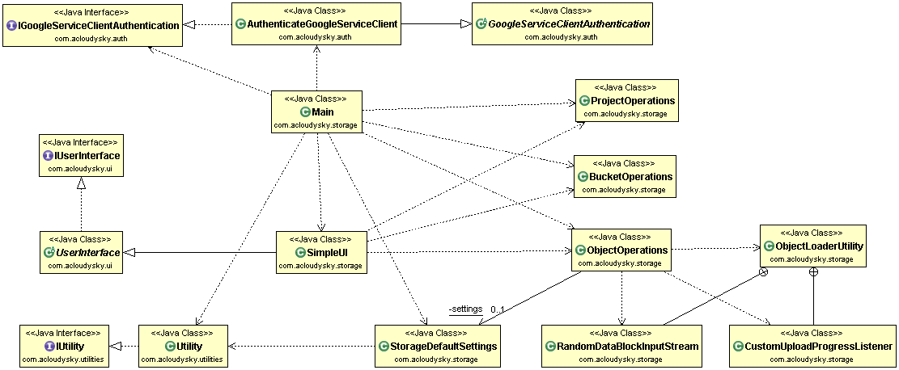

# gcp-storage-client

Java console application showing how to interact with Google Cloud Storage.This is a simple command line client application that eliminates unnecessary clutter and shows the basic logic to interact with Google Cloud Storage. Hopefully this will help you to understand the syntax (and semantic) of the API.
The following figure is the application architecture (class diagram):

 

The application interacts with the [Google Cloud Storage](https://cloud.google.com/storage/docs/overview) via its REST API using the related Google Java client library. For more information, see [Google API Client Libraries](https://developers.google.com/api-client-library/). See also [Cloud Programming REST API](http://acloudysky.com/cloud-programming-rest-api/). 
See related blog post at [Build GCP Cloud Storage Client](http://acloudysky.com/build-gcp-cloud-storage-client/). 

## Prerequisites
You must have Maven installed. The dependencies are satisfied by building the Maven package. 
The application uses a custom client authentication app. The app is included as a JAR in the downloadable code. Please include this JAR in your project. For more information, see [GCP Cloud Service Client Apps – Common Tasks](http://acloudysky.com/create-google-cloud-service-apps-common-tasks/).
See also [Build GCP Service Authentication](http://acloudysky.com/build-gcp-service-authentication/). 

### Security Credentials
You need to set up your Google security credentials before the sample code is able to connect to the Google Storage service. You can do this by creating a file named "client_secrets.json" at ~/.store/storage_sample (C:\Users\USER_NAME.store\storage_sample\ for Windows users) and saving the following information in the file:

1. Client ID
2. Client secrets
3. Other...

You obtain this information by downloading the JSON format of the <i>client information for native application</i> of your project at: [Google Console](https://console.developers.google.com/project). Then copy this information in the <i>secretsFile</i> such as client_secrets.json. <b>Keep this file in a safe place</b>.

### Default Settings
The application assumes that a file exists that contains default settings. The file is assumed to be at ~/.store/storage_sample/sample_settings.json  (C:\Users\USER_NAME.store\storage_sample\sample_settings.json for Windows users). The settigs are in Jason format similar to the following: 

	"project": "<your project ID>",
   	"defaultbucket": "<name of your default bucket>",
  	"defaultobject": "<name of your default object>",
  	"prefix": "<your prefix>", 
  	"email":<your e-mail>" 
	

			 
<h2>Running the Example</h2>
The application connects to <a href="https://cloud.google.com/storage/docs/overview" target="_blank">Google Cloud Storage</a>, and allows the user to create a bucket, upload an object into the bucket, download the object, delete the object and delete the bucket. All you need to do is run it by following these steps:

1. From the project, create an executable JAR
2. From a terminal window, go to the directory containing the JAR and execute a command similar to the following:   

		java -jar gcp-storage-client.jar	

## License
This sample application is distributed under the 

[Apache License, Version 2.0](http://www.apache.org/licenses/LICENSE-2.0)

 
